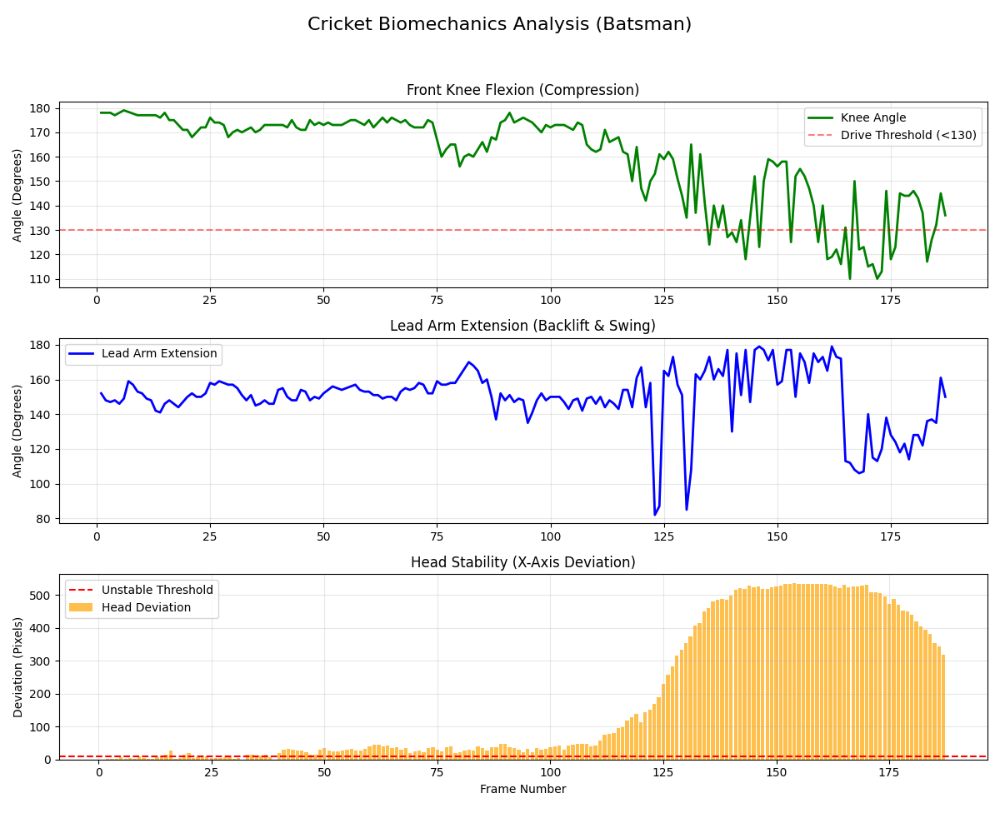

#  AI/ML Computer Vision : Cricket Batting Biomechanics Analysis

##  Project Summary
This pipeline demonstrates a real-world solution for sports biomechanics analysis using phone video. The core success of this project lies in overcoming practical constraints, specifically **foreground occlusion (the net)** and **signal noise (jitter)**, to extract meaningful, coach-actionable metrics.

###  Key Deliverables
*   **Video Demo:** [https://drive.google.com/file/d/1Me8VqD5DmNPSOpoXZot-o99CztKu25oe/view?usp=sharing](https://drive.google.com/file/d/1Me8VqD5DmNPSOpoXZot-o99CztKu25oe/view?usp=sharing)
*   **Segmented Video Output:** `outputs/segmented_analysis.mp4` (Included in the Drive link)
*   **Metrics Report:** `outputs/metrics.csv`
*   **Code:** Cleanly structured in `src/`

---

##  Section 1: Thinking & Methodology

### 1. Model Choice & Occlusion Handling
The video provided a significant challenge: a net mesh directly in front of the subject.
*   **Model:** Selected **YOLOv8-Pose (Top-Down)**.
*   **Justification:** YOLO's approach (detect person box first, then keypoints) is inherently more resilient to clutter than bottom-up models (like MediaPipe/OpenPose), minimizing interference from the net.
*   **Noise Filtration:** Implemented a **Confidence Threshold Filter (Conf > 0.5)** in `main.py` to discard unreliable keypoints and prevent visual flicker.

### 2. Automated Temporal Segmentation (The Advanced Feature)
Instead of static analysis, a **One-Way State Machine** was implemented in `src/phase.py` to automatically classify the shot into phases based on movement thresholds derived from the initial data analysis:

| Phase | Thresholds Triggering State | Biomechanical Meaning |
| :--- | :--- | :--- |
| **Stance** | `Head Deviation < 15px` | Static setup, ready position. |
| **Trigger** | `Head Deviation > 15px` | Initial minor movement toward the ball. |
| **Execution** | `Knee Angle < 155°` OR `Head Deviation > 80px` | Full commitment to the shot (Power Transfer). |
*   *Benefit:* This segmentation prevents label flickering and allows coaches to isolate metrics only during the critical power generation window.

---

##  Section 2: Biomechanical Metrics Defined

The pipeline focuses on three key performance indicators:

| Metric | Calculation | Biomechanical Significance |
| :--- | :--- | :--- |
| **Front Knee Angle** | Angle between Hip, Knee, and Ankle (Lead Leg). | Measures leg compression. A rapid drop (flexion) shows energy storage before impact. |
| **Head Stability (X-Dev)** | Horizontal deviation of the `Nose` keypoint from the initial stance position. | Quantifies the aggression/depth of the forward stride (momentum transfer and balance control). |
| **Lead Arm Angle** | Angle between Shoulder, Elbow, and Wrist. | Measures the efficiency of the backlift and the extension through the ball contact point. |

---

##  Section 3: Visual Insights & Technical Evaluation

### Biomechanics Dashboard
*(Visualization generated using `src/visualize_data.py`)*



#### **Key Insights Extracted from the Data:**
1.  **Compression Profile (Knee Angle):** The angle holds steady at 175° (Stance/Setup) and shows a sharp, deep drop (to below 130°) coinciding exactly with the transition to the **Execution phase**. This indicates strong, effective leg compression for power.
2.  **Forward Momentum:** The Head Deviation shows aggressive movement, spiking rapidly, quantifying the batsman's large forward stride and proving high momentum transfer.
3.  **Arm Occlusion:** The Lead Arm Extension (blue line) exhibits the highest level of noise/spikes, confirming visual instability, likely due to the bat and body causing severe occlusion of the hands during the rapid swing.

### Technical Accuracy (Jitter)
Since ground truth (human-labeled) data was unavailable to calculate gold-standard metrics like PCK or MPJPE, I measured **Temporal Consistency (Jitter)**.

*   **Metric:** Average Frame-to-Frame Jitter (on the Knee Angle).
*   **Result:** **3.56° per frame** (Acceptable, but noisy).
*   **Self-Critique:** This jitter confirms the pipeline requires a heavy-duty signal processor (like a Kalman Filter) if the metrics are to be used for advanced velocity or acceleration calculations.

---

##  Section 4: Future Improvements (The Improvement Plan)

1.  **3D Pose Lifting & Camera Calibration:** The primary limitation is the 2D nature of the angles (projection error). Future work requires using 3D pose lifting (e.g., VideoPose3D) combined with **camera calibration** (to convert pixels to real-world meters) to calculate true anatomical angles and absolute velocity.
2.  **Signal Smoothing Filter:** Integrate a **OneEuro Filter** or **Kalman Filter** directly onto the keypoint coordinates *before* calculating angles, specifically to reduce the observed 3.5° jitter and stabilize the metrics.
3.  **Model Adaptation:** Synthetically augment training data with real-world noise patterns (nets, varied lighting) to fine-tune YOLO and make it functionally immune to common amateur video artifacts.


##  How to Run the Project

1.  **Clone the Repository:**
    ```bash
    git clone [YOUR GITHUB URL HERE]
    cd Cricket_Biomechanics_Analysis
    ```

2.  **Setup Environment (Python 3.8+ recommended):**
    ```bash
    python -m venv venv
    .\venv\Scripts\activate  # Windows
    # source venv/bin/activate # Mac/Linux
    
    # Install dependencies (requires ultralytics, opencv, numpy, pandas)
    pip install ultralytics opencv-python numpy pandas
    ```

3.  **Run the Analysis Pipeline:**
    ```bash
    # Note: Requires the video file in the inputs/ directory
    python main.py
    ```

4.  **Generate the Metrics Dashboard:**
    ```bash
    python src/visualize_data.py
    ```
